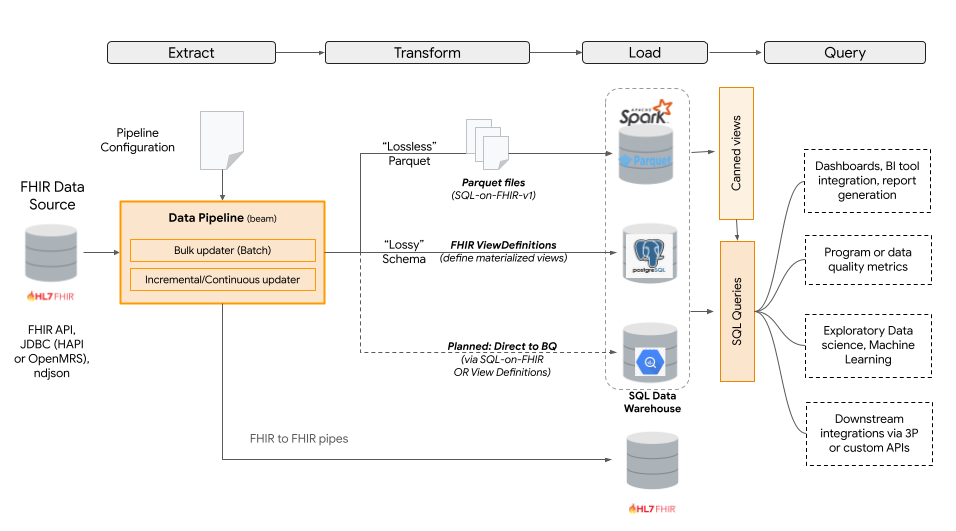

# Introduction

The Open Health Stack's [FHIR Data Pipes](https://https://github.com/google/fhir-data-pipes) provides a collection of tools to transform complex FHIR (Fast Healthcare Interoperability Resources) data into formats for running _analytics_ workloads and building services. 

Using OHS, developers can use familiar languages (such as python or ANSI SQL), packages and tools to build analytics solutions for different use cases: from generating reports and powering dashboards to exploratory data science and machine learning.



*Caption: FHIR Data Pipes Graphic* 

**Key features**

*	Transform FHIR JSON Resources (STU3 and R4) to a (near) _"lossless"_ Parquet representations based on the SQL-on-FHIR-v1 schema

* 	Horizontally scalable Apache Beam based ETL pipeline to continuously transform FHIR data. Support for local, on-prem or cloud deployment options

* 	Seamless support for different Data Warehouses from traditional RDBMS (such as [PostgreSQL](https://www.postgresql.org/)), OLAP Database Engines (such as [duckdb](https://duckdb.org/)) to Distributed query engines (such as [SparkSQL](https://spark.apache.org/sql/))

*	Define views in ANSI SQL or as ViewDefinition Resources to create flattened tables to power different analytics solutions

**Usage FHIR Data Pipes**
The *primary use case* for FHIR Data Pipes is to enable continuous transformation of FHIR Data into analytics friendly representations.

A secondary use case is for piping FHIR data from different sources into a central FHIR repository (early stage).

## Horizontally scalable ETL Pipeline
The ETL Pipeline is implemented in Apache Beam and can utilize different runners depending on the environment (local, on-prem or cloud).
Extraction:

FHIR Data Pipes is designed to work with any FHIR source data. 

*   Valid FHIR Server API (e.g. HAPI FHIR)
*   FHIR Facade (e.g. OpenMRSv3)
*   Bulk Export API data (as ndjson)
*   ndjson representation

## Transformation to "Lossless" schema

Uses bunsen to transform from FHIR (STU3, R4) to the SQL-on-FHIR-v1 schema 
Configurable support for FHIR profiles and extensions on a per Resource basis

## Loading into DWH

FHIR Data Pipes supports different SQL Data Warehouse options depending on the needs of the project. These include:

*   Loading Parquet into an OLAP data warehouse such as SparkSQL, duckdb or others 
*   Distributed query engine such as SparkSQL (example provided)
*   Traditional RDBMS such as Postgres (when using the "lossy" FHIR ViewDefinitions Resources)

To learn about the Pipelines Controller see here (link to pipelines controller in the advanced guides)

## Querying Data
When working with the SQL-on-FHIR-v1 schema, one major challenge is handling the many nested or repeated fields (such as condeable concepts). 

This depends on the different nuances of SQL dialects. For example:

*   _Spark SQL_: `LATERL VIEW explode()`
*   _BigQuery:_ `Simple JOIN`
*   _JSON:_ `CROSS JOIN LATERAL jsonb_array_elements()`

[Click here to see examples of SQL-on-FHIR-v1 queries]

Example of an SQL-on-FHIR-v1 query using the EXPLODE and LATERAL VIEW approach in Spark SQL

``` sql
SELECT
  O.id AS obs_id, O.subject.PatientId AS patient_id,
  O.status AS status
FROM Observation AS O LATERAL VIEW explode(code.coding)
  AS OCC LATERAL VIEW
  explode(O.value.codeableConcept.coding) AS OVCC
WHERE OCC.`system`=
    "https://openconceptlab.org/orgs/CIEL/sources/CIEL"
  AND OCC.code="1255"
  AND OVCC.`system`=
    "https://openconceptlab.org/orgs/CIEL/sources/CIEL"
  AND OVCC.code="1256"
  AND YEAR(O.effective.dateTime) = 2010;
```

A common pattern to address this is to flatten the data into a set of views of tables which can then be queried using simpler SQL statements. 

### Flattening FHIR Resources
To make it easier to query data, FHIR Data Pipes provides two approaches for flattening the FHIR Resources into virtual or materialized views

1.  SQL queries to generate virtual views (outside the pipeline)
2.  Apply FHIR ViewDefinition Resources (SQL-on-FHIR-v2 spec) to generated materialized views (within the pipeline)

For both of these approaches, predefined “view definitions” (SQL or JSON) for common resources are provided. These can be modified or extended.

### SQL defined views
These are samples of more complex SQL-on-FHIR queries for defining flat views for common FHIR Resources (see here for up to date list)

For each Resource supported, a “_flat” view is generated (e.g. Patient_flat, Observation_flat). These can be used in the downstream SQL query engine. The queries, which have .sql suffix can be found here: /docker/config/views (e.g Patient_flat.sql)

An example of a flat view for the Observation Resource is below

```sql
CREATE OR REPLACE VIEW flat_observation AS
SELECT O.id AS obs_id, O.subject.PatientId AS patient_id,
        OCC.`system` AS code_sys, OCC.code,
        O.value.quantity.value AS val_quantity,
        OVCC.code AS val_code, OVCC.`system` AS val_sys,
        O.effective.dateTime AS obs_date
      FROM Observation AS O LATERAL VIEW OUTER explode(code.coding) AS OCC
        LATERAL VIEW OUTER explode(O.value.codeableConcept.coding) AS OVCC
```

Learn more:

[Examples of SQL-on-FHIR-v1 queries for defining views](https://github.com/google/fhir-data-pipes/blob/27d691e91d0fe6ef4c9624acba4e68bca145c973/query/queries_and_views.ipynb) 

### FHIR ViewDefinition Resource views
The [SQL-on-FHIR-v2 specification](https://build.fhir.org/ig/FHIR/sql-on-fhir-v2/) defines a standards based pattern for defining Views as FHIRPath expressions in a logical structure to specify the column names and values (as unnested items).

A system (pipeline or library) that implements the “View Layer” of the specification provides a View Runner that is able to process these FHIR ViewDefinition Resources over the “Data Layer” (lossless representation of the FHIR data). The output of this are a set of portable, tabular views that can be consumed by the “Analytics Layer” which is any number of tools that can be used to work with the resulting tabular data.
 
FHIR Data Pipes is a reference implementation of the SQL-on-FHIR-v2 specification:

*   The "View Runner" is by default part of the ETL Pipelines and uses the transformed Parquet files as the “Data Layer”. _This can be extracted to be a stand-alone component if required_

*   When enabled as part of the Pipeline configuration, it will apply the ViewDefinition Resources from the /config/views folder and materialize the resulting tables to the PostgresSQL database.

*   A set of pre-defined ViewDefinitions for common FHIR Resources is provided as part of the default package. These can be adapted, replaced and extended

*   The FHIR Data Pipes provides a simple ViewDefinition Editor which can be used to explore FHIR ViewDefinitions and apply these to individual FHIR Resources